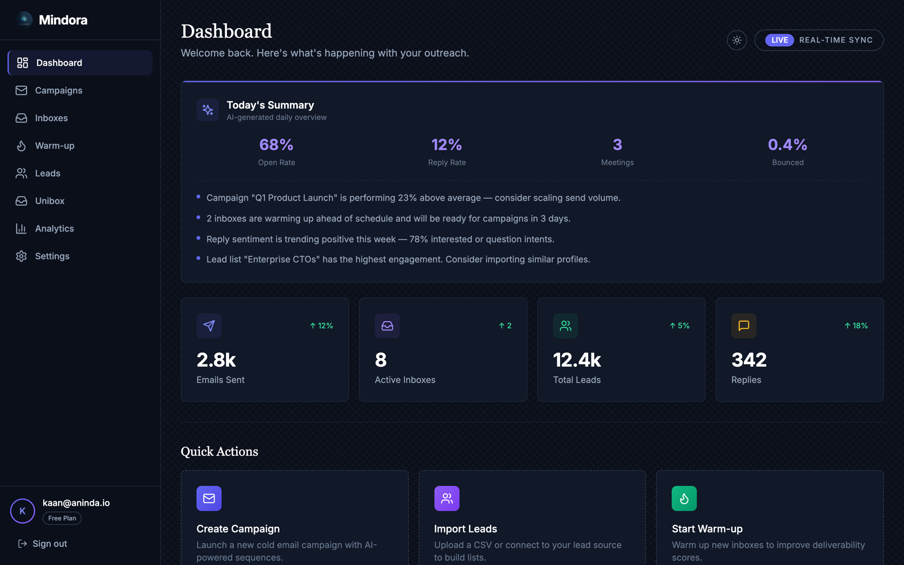
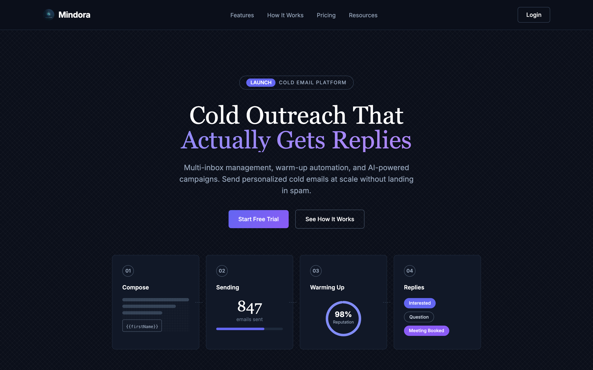

# Aninda

Cold email outreach platform for agencies and small sales teams. It covers the whole loop: connect inboxes, warm them up, import and verify leads, run multi-step campaigns, and handle replies from a single place.

Screenshots show the app under Mindora, the name the product later shipped with.



## Features

- **Campaigns**: multi-step sequences with delays, A/B variants and spintax. A smart template system fills `[instruction]` placeholders with AI-generated text per lead at send time (details in [docs/smart-campaign.md](docs/smart-campaign.md)).
- **Inboxes**: Gmail, Microsoft 365 and plain SMTP accounts behind one interface, with connection health checks.
- **Warmup**: automated warmup conversations between your own inboxes, with ramp-up scheduling and reputation tracking.
- **Unibox**: replies from every inbox in one view, classified by intent (interested, question, meeting booked).
- **Leads**: CSV import with syntax and DNS/MX verification, and a state machine that tracks where each lead sits in the funnel.
- **Analytics**: opens, clicks, replies and bounces per campaign and per inbox.
- **Deliverability**: bounce processing, send-time optimization and per-inbox sending limits.



## Architecture

pnpm + Turborepo monorepo, three apps and three shared packages:

```
apps/
  web        Next.js 14 dashboard (App Router, Tailwind, Radix UI)
  api        NestJS REST API: auth, campaigns, inboxes, leads, warmup,
             replies, analytics, tracking, webhooks
  workers    BullMQ background jobs: email sender, campaign scheduler,
             warmup, reply scanner, bounce processor, A/B test optimizer

packages/
  database      Supabase client and generated types
  email-client  Gmail, Microsoft Graph and SMTP senders behind one interface
  shared        DNS validation, email verification, lead state machine,
                send-time optimizer
```

Postgres, auth and row-level security come from Supabase. Queues run on Redis through BullMQ. Each app has its own Dockerfile.

## Running locally

Requirements: Node 20+, pnpm 9, Redis, and a Supabase project.

```bash
pnpm install

# environment
cp apps/web/.env.local.example apps/web/.env.local   # Supabase URL + keys
cp apps/api/.env.example apps/api/.env               # API secrets, Redis URL

# database schema
./scripts/run-migrations.sh

# start web, api and workers together
pnpm dev
```

The dashboard runs on `localhost:3000`, the API on `localhost:3001`.

## Tests

Audit-style suites live under `tests/`: campaign logic, scheduling, analytics, smart templates and a pre-launch checklist.
